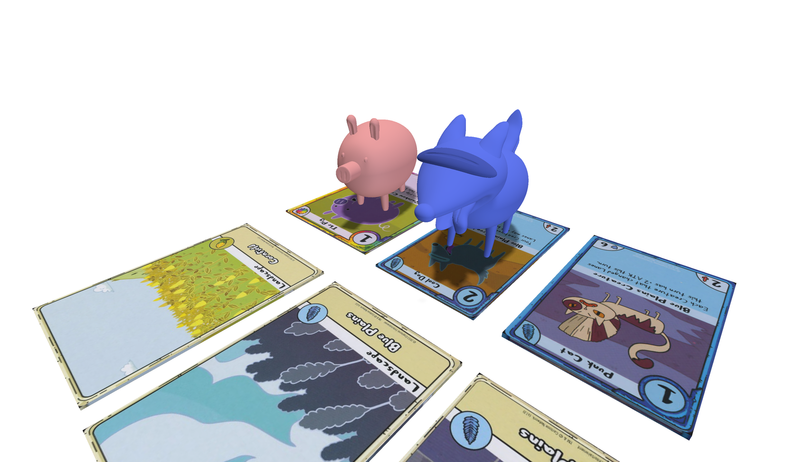

# Adventure Time Card Wars AR Mobile

Scripts and some assests for AR Card Wars app. Main logic lies in `Spawn.cs` and `PlaceField.cs`. Applicable to any card game that has cards which contain a large number of geometric features and less repeating patterns. 

### Unity Dependencies
- AR Foundation, XR Interaction Toolkit: for building an AR app
- [Lean Touch](https://assetstore.unity.com/packages/tools/input-management/lean-touch-30111?srsltid=AfmBOoou-D_XLGJWugq6Konomy5zWdfGUn_sKqNZfKH09ZNetlQv23rY): for handling user input (touch, twist, drag etc.)
- (Optional) Android Logcat: for debugging on an Android device

### Key Components
- AR Tracked Image Manager: recognises specific cards within a given library (XR Reference Image Library) 
- AR Plane Manager: for detecting horizontal (and vertical) planes, especially useful for board games settings
- AR Raycast Manger: used for raycasting, useful in determining where on a detected surface the user is tapping or pointing, allowing characters or objects to be placed accurately in the real world  
